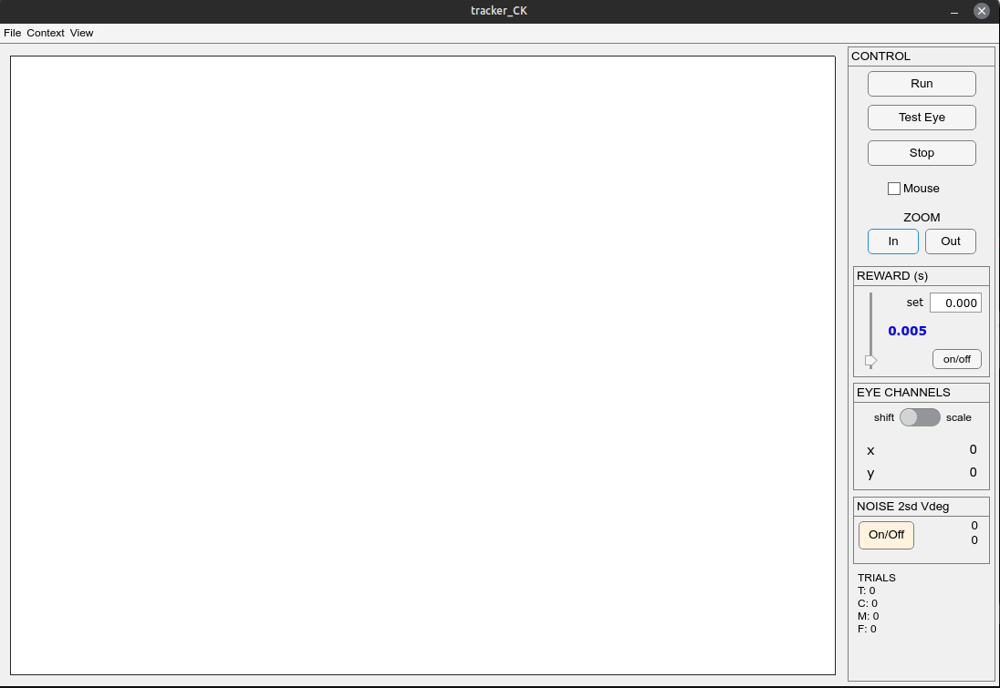

# Tracker-MRI    

This is a brief manual of [Tracker-MRI](https://github.com/VisionandCognition/Tracker-MRI), a version of the Vision & Cognition experimental control software [Tracker](https://github.com/VisionandCognition/Tracker) specifically adjusted for the NHP-MRI research lines. Cite this work as:
Chris van der Togt, Chris Klink, Paolo Papale, & Rob Teeuwen. (2022). VisionandCognition/Tracker: Public Release (Version v2022). Zenodo. [https://doi.org/10.5281/zenodo.6489014](https://doi.org/10.5281/zenodo.6489014)    

## Github    
This software is hosted on Github for version control. Find it here: [https://github.com/VisionandCognition/Tracker-MRI](https://github.com/VisionandCognition/Tracker-MRI).     

## How to launch    
Launch the Tracker GUI bui running the function `runtracker(gui_color,gui_engine,daspresent)`. The option `gui_color` can be `dark` or `light` and determines the background color of the GUI. The option `gui_engine` can be `guide` or `mlapp`. GUIDE is the old gui engine used by Matlab but it will be discontinued in the future and has been replace with MLAPP. Both should work the same for now, but `mlapp` is preferred for the future. The option `daspresent` can be `0 or 1` and indicates the presence of a DAS card. If this is set to `0` dummy files (`dasdummy`) will be loaded to prevent Matlab from trying to communicate with a non-existing PCIe card and erroring. This way you can debug code easier. [NB! not sure if this has been tested in Tracker-MRI]    

To make launching easier, we create `bat` files like `runtracker2022b_cg.bat`. These are MS Windows launch scripts in which we can predefine the options and launch Matlab and Tracker through a single shortcut on the desktop. It then launches Matlab (change to path in the launcher to where your Matlab executable is located) with the directory it is in as active path and executes the script `runtracker` with the predefined options.     

## User interface    
As stated there are two gui option but they look very similar. We will only show the `mlapp` version here.        

     

In the large rectangle on the left you will see a representation of the screen boundaries, the current eye-position of the participant, and stimulus aspects like the fixation dot, fixation window, and potential saccade targets. You can zoom in and out of this view with the zoom buttons on the right. Both the reward slider and `set` box allow you to specify the amount fo reward on the fly. You can also set more complicated reward strategies in your `ParSettings` file and write code on how to deal with it in your `runstim.m` (see below). The `EYE CHANNELS` box allows adjustment of the offset and gain of the eye signal. Pressing `z` with the gui selected will re-center the eye position to (0,0). The `Run` and `Stop` will execute and break out of whatever you define in your `runstim.m`.    

The `File` menu is mostly legacy. You will only use it to exit Tracker the right way. This ensures that the connection with the das card is properly closed, which doesn't happen when you just close the window.    

The `Mouse` checkbox emulates the eye-signal, controlled by the mouse cursor (you may need to re-center with `z`). Great for debugging and testing code.       

The `Context` menu allows switching to another experiment or selecting other settings (see below). The `View` menu allows toggling between the dark and light Tracker versions.        

## Display option     
Upon launching Tracker, it will first ask what setup you are running from. This is because the screen in the 3T MR at Spinoza is mirrored to facilitate the human experiments in which participants view the screen via a mirror. Our subject have a straight view of the screen so we either have to change the hardware settings or un-mirror in our software. The latter is easier and avoids issues with other researchers and Spinoza Staff. Such un-mirroring is not necessary in the Mock training setup.   

## Experiment folders     
The next question you get in a pop-up is what experiment folder you want to launch in. Each line of experiments may have unique requirements for the core experiment control engine (e.g., information in the gui, assignment of analog/digital channels) so they currently each come with their own `engine` folder that runs the user interface and control library. You can easily switch between experiment folders in the gui by choosing `New ExpFolder` from the `Context` menu. Apart from the `engine` folder there is an `Experiment` folder in each type of experiment. It contains `runstim.m`, the core experimental control script that runs the experiment, and one or more `StimSettings` and `ParSettings` files.       

## Core files to run an experiment    
You can select experiment settings files from the gui `Context` menu. In the same `Context` menu you can also set or change the monkey name/label. This information is ideally set in a `ParSettings` file but this menu-option can be useful for debugging etc.     

### runstim.m    
This file will be executed when you click `Run` in the gui. It controls the experiment logic.    
For an example of a trial-based stucture (fixate > stimulus > target > response > reward > iti), see [runstim](runstim.html). It also illustrates the calls to the DAS card.

### ParSettings.m    
A `ParSettings` file defines crucial aspects of your setup/behavioral control, like hardware initiatalization or reward strategies. These are usually participant-specific.      

### StimSettings.m     
A `StimSettings` file defines crucial aspects of your stimulus and is usually specific to an experiment and/or setup.      

## Under the hood      
These are the dependencies that make Tracker-MRI work.    

### Matlab     
This software runs on [Matlab](https://www.mathworks.com/products/matlab.html). Any version later than 2014 should be fine.    

### Psychtoolbox     
The graphics engine used for stimulus control is [Psychtoolbox-3](http://psychtoolbox.org/). Make sure you install it the right way and have it added to the Matlab path.    

### Das-card     
We use a Measurement Computing A/D card [PCIe-DAS1602/16](https://www.mccdaq.com/pci-data-acquisition/PCIe-DAS1602-16.aspx) which breaks out to an in-house built BNC connection box that allows interfacing with peripherals such as Eyetrackers, reward systems, photo-amplifiers, LEDs, etc. To interface with the card using matlab, we have compiled a library of mex-files (`das64`). Some of the specific calls to the card can be found in [trackermanual](trackermanual.html). This is a rather old manual but the section on DAScontrol library is still relevant (the other parts not so much).    
